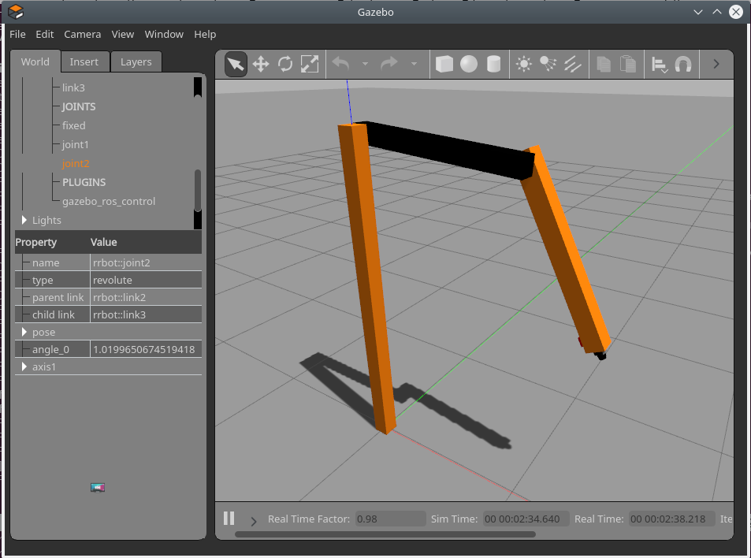

# RRBOT

Simple 2 link robot

## usage

```bash
# from workspace root
source env.sh

# run app shortcut to load tmux session
app
```

## to read
- [jetbot i2c](https://mikelikesrobots.github.io/blog/jetbot-motors-pt1/)
        - [JetBot ROS Control](https://github.com/mikelikesrobots/jetbot-ros-control/tree/main)
- [hexpod_ros](https://github.com/KevinOchs/hexapod_ros)
- [](https://community.aws/content/2dk9wWbrwCB7PDXhblRFe0iaBbK/building-a-ros2_control-system-ros2-control-with-the-jetbot-part-2?lang=en)

---

## ros2_control




## Position Controllers

```xml
<robot>

    <!-- Hardware-->
    <ros2_control name="GazeboSystem" type="system">
        <hardware>
            <plugin>gazebo_ros2_control/GazeboSystem</plugin>
        </hardware>
        <joint name="joint1">
            <command_interface name="position" />
            <command_interface name="velocity" />
            <state_interface name="position" />
        </joint>
        <joint name="joint2">
            <command_interface name="position" />
            <command_interface name="velocity" />
            <state_interface name="position" />
        </joint>

    </ros2_control>

    <!-- ros2 control gazebo plugin-->
    <gazebo>
        <plugin filename="libgazebo_ros2_control.so" name="gazebo_ros2_control">
            <parameters>$(find rrbot_bringup)/config/position.yaml</parameters>
        </plugin>
    </gazebo>
</robot>
```

```bash
ros2 control list_hardware_interfaces 
command interfaces
        joint1/position [available] [unclaimed]
        joint2/position [available] [unclaimed]
state interfaces
        joint1/position
        joint2/position
```

```bash
ros2 run controller_manager ros2_control_node --ros-args --params-file /workspaces/rrbot_ws/src/rrbot_bringup/config/position.yaml
```

```bash
ros2 run controller_manager spawner joint_state_broadcaster
ros2 run controller_manager spawner forward_position_controller
```

```bash
ros2 topic pub --once /forward_position_controller/commands std_msgs/msg/Float64MultiArray "data:
- 0.5
- 1.5"
```

## Velocity controllers
### JointGroupVelocityController
The JointGroupVelocityController is a ROS 2 controller that allows you to command the velocity of multiple joints in a robot. The controller receives velocity commands for a group of joints and sends those commands to the hardware interface, which in turn controls the robot's actuators to achieve the desired joint velocities.

[velocity_controllers](https://control.ros.org/rolling/doc/ros2_controllers/velocity_controllers/doc/userdoc.html)


```xml
<robot>

    <!-- Hardware-->
    <ros2_control name="GazeboSystem" type="system">
        <hardware>
            <plugin>gazebo_ros2_control/GazeboSystem</plugin>
        </hardware>
        <joint name="joint1">
            <command_interface name="position" />
            <command_interface name="velocity" />
            <state_interface name="position" />
        </joint>
        <joint name="joint2">
            <command_interface name="position" />
            <command_interface name="velocity" />
            <state_interface name="position" />
        </joint>

    </ros2_control>

    <!-- ros2 control gazebo plugin-->
    <gazebo>
        <plugin filename="libgazebo_ros2_control.so" name="gazebo_ros2_control">
            <parameters>$(find rrbot_bringup)/config/velocity.yaml</parameters>
        </plugin>
    </gazebo>
</robot>
```

```bash
ros2 launch rrbot_bringup sim.launch.py


```

```bash
ros2 control list_hardware_interfaces 
command interfaces
        joint1/position [available] [unclaimed]
        joint1/velocity [available] [unclaimed]
        joint2/position [available] [unclaimed]
        joint2/velocity [available] [unclaimed]
state interfaces
        joint1/position
        joint2/position
```


```bash
ros2 run controller_manager ros2_control_node --ros-args --params-file /workspaces/rrbot_ws/src/rrbot_bringup/config/velocity.yaml
```

```bash
ros2 run controller_manager spawner joint_state_broadcaster
ros2 run controller_manager spawner velocity_controller
```

```bash
ros2 topic pub --once /velocity_controller/commands std_msgs/msg/Float64MultiArray "data:
- 0.0
- 1.5"
```

## Effort (group)

```bash
ros2 run controller_manager ros2_control_node --ros-args --params-file /workspaces/rrbot_ws/src/rrbot_bringup/config/efforts.yaml
```

```bash
ros2 run controller_manager spawner joint_state_broadcaster
ros2 run controller_manager spawner effort_controller
```


### pid
```bash title="pid setpoint"
ros2 topic pub --once /desired_position std_msgs/msg/Float64MultiArray "data:
- 1.0"
```


---

```
ros2 launch rrbot_bringup controllers_s.launch.py

ros2 topic pub /position_controller/commands std_msgs/msg/Float64MultiArray "{data: [1.0]}"
ros2 topic echo --once /dynamic_joint_states
```